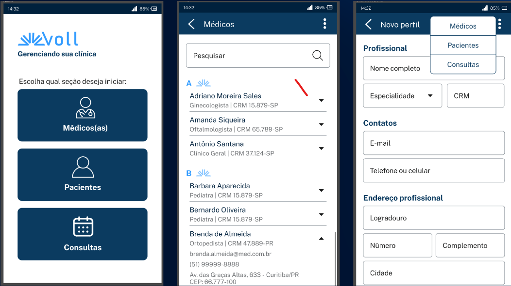

# Objetivos
  - Desenvolvimento de uma API Rest
  - CRUD (Create, Read, Update e Delete)
  - Validações
  - Paginação e ordenação

O objetivo neste curso é usarmos o Spring Boot para desenvolvermos uma API Rest, com algumas funcionalidades. A ideia é desenvolver um CRUD, sendo as quatro operações fundamentais das aplicações: cadastro, listagem, atualização e exclusão de informações.

Isto é, aprenderemos a desenvolver um CRUD de uma API Rest usando o Spring Boot.

Vamos ver também como aplicar validações das informações que chegam na nossa API, usando o Bean Validation. Depois, vamos aprender a utilizar o conceito de paginação e ordenação das informações que a nossa API vai devolver.
### Tecnologias

  - Spring Boot 3
  - Java 17
  - Lombok
  - MySQL/ Flyway
  - JPA/Hibernate
  - Maven
  - Insomnia

Faremos tudo isso usando algumas tecnologias, como **Spring Boot 3** , sendo a última versão disponibilizada pelo framework. 
Usaremos, também, o **Java 17** sendo a última versão LTS (Long-term support, em português "Suporte de longo prazo") que possui maior tempo de suporte disponível para o Java.

Aprenderemos a usar alguns recursos das últimas versões do Java para deixarmos o nosso código mais simples. 
Utilizaremos em conjunto com o projeto o **Lombok**, responsável por fazer a geração de códigos repetitivos, como getters, setters, toString, entre outros. 
Tudo via anotações para o código ficar menos verboso.

Usaremos o banco de dados **MySQL** para armazenar as informações da **API** e junto com ele utilizaremos a biblioteca **Flyway.**
Isso para termos o controle do histórico de evolução do banco de dados, um conceito que chamamos de Migration.

A camada de persistência da nossa aplicação será feita com a **JPA (Java Persistence API)**, com o **Hibernate** como 
implementação dessa especificação e usando os módulos do **Spring Boot**, para tornar esse processo o mais simples possível.

Usaremos o **Maven** para gerenciar as dependências do projeto, e também para gerar o build da nossa aplicação. 
Por último, como focaremos na **API Rest (apenas no Back-end)**, não teremos interface gráfica, como páginas HTML e nem Front-end e aplicativo mobile.

Mas para testarmos a API, usaremos o **Insomnia**, sendo uma ferramenta usada para testes em API. 
Com ela, conseguimos simular a requisição para a API e verificar se as funcionalidades implementadas estão funcionando.

Essas são as tecnologias que usaremos ao longo deste curso.
### Qual é o nosso projeto?    

    

Trabalharemos em um projeto de uma clínica médica fictícia. Temos uma empresa chamada *Voll Med*, que possui uma clínica
que precisa de um aplicativo para monitorar o cadastro de médicos, pacientes e agendamento de consultas.

Será um aplicativo com algumas opções, em que a pessoa que for usar pode fazer o **CRUD**, tanto de médicos quanto de 
pacientes e o agendamento e cancelamento das consultas.

Vamos disponibilizar esse protótipo, mas lembrando que é somente para consultas, para visualizarmos como seria o Front-end.
Isso porque o foco deste curso é o Back-end.

A documentação das funcionalidades do projeto ficará em um quadro do **[Trello](https://trello.com/b/O0lGCsKb/api-voll-med)** com cada uma das funcionalidades. 
Em cada cartão teremos a descrição de cada funcionalidade, com as regras e validações que vamos implementar ao longo do projeto.    

Para facilitar o entendimento, dado que vamos desenvolver somente API Back-end (não teremos interface gráfica), 
vamos disponibilizar os protótipos das telas do aplicativo no **[Figma](https://www.figma.com/file/N4CgpJqsg7gjbKuDmra3EV/Voll.med)**.    

Esse é o nosso objetivo neste curso, aprender a usar o **Spring Boot na versão 3** para desenvolvermos o projeto dessa 
clínica médica, utilizando as tecnologias mencionadas anteriormente.    
